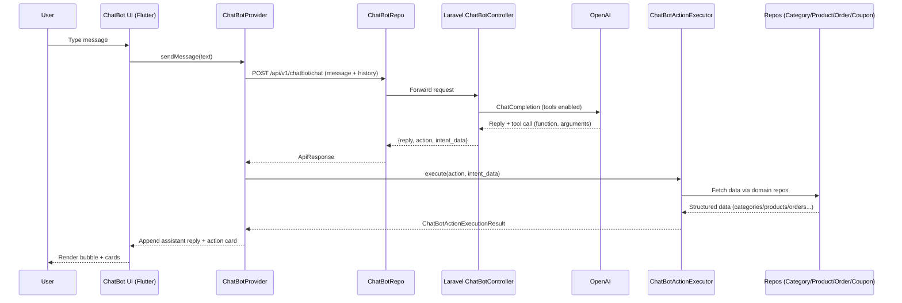

# Chatbot Architecture Overview

This document explains how the in-app AI assistant is wired across Laravel and Flutter, highlights the responsibilities of each layer, and illustrates the full request/response flow with a Mermaid diagram.

## High-Level Summary

- **Intent detection (Laravel):** `app/Http/Controllers/Api/V1/ChatBotController.php` forwards the user prompt plus recent history to OpenAI. If the model emits a tool call, the controller returns the tool name (`action`) and JSON arguments (`intent_data`) *without* executing any business logic. Only a conversational fallback reply is included.
- **Transport (Flutter):** `lib/features/chatbot/domain/reposotories/ChatBotRepo.dart` sends the request to the chatbot endpoint, logging payloads/responses for debugging. It keeps the history limited to the bubbles the UI already rendered.
- **Client-side execution:** `lib/features/chatbot/providers/ChatBotProvider.dart` orchestrates UI state. When the backend reports an `action`, the provider delegates to `ChatBotActionExecutor` to run the actual repository/service calls locally, merge the structured data, and update the transcript.
- **Action execution:** `lib/features/chatbot/domain/services/chatbot_action_executor.dart` calls the existing product, category, order, and coupon repositories. It normalizes payloads so cards such as menu categories, product lists, or order tracking status can re-use the same data contracts as the rest of the app.
- **UI rendering:** `lib/features/chatbot/screens/chatbot_bottom_sheet.dart` turns each `ChatBotMessage` into user/assistant bubbles plus contextual cards (categories, products, coupons, orders, etc.).

## Detailed Flow

1. **User input:** The user types a request (e.g., "Show me pizza items"). `ChatBotProvider.sendMessage()` appends the user bubble and posts the message to the backend through `ChatBotRepo`.
2. **Backend intent pass-through:** `ChatBotController` calls OpenAI with the conversation history and tool definitions. When the model calls a tool such as `get_category_products`, the controller returns `{ reply, action, intent_data }`, skipping all server-side product/order logic.
3. **Local execution:** Back on the device, the provider inspects the action. It runs `ChatBotActionExecutor.execute()` with the supplied `intent_data`. That executor makes the necessary repo calls (category list, search, orders, coupons, etc.) and formats the result.
4. **UI update:** The provider replaces the assistant reply and attaches the structured data returned by the executor. The bottom-sheet UI sees the action/data pair and renders the appropriate rich card.
5. **Iterative context:** The conversation history only stores the text bubbles, so subsequent turns retain the correct context without duplicating structured payloads.

## Files & Responsibilities

| Layer | File(s) | Responsibility |
| --- | --- | --- |
| Backend intent detection | [app/Http/Controllers/Api/V1/ChatBotController.php](../app/Http/Controllers/Api/V1/ChatBotController.php) | Calls OpenAI, validates tool calls, returns intent metadata + friendly text. |
| API transport | [lib/features/chatbot/domain/reposotories/chatbot_repo.dart](../lib/features/chatbot/domain/reposotories/chatbot_repo.dart) | Builds request body, logs payloads, handles Dio timeouts. |
| State management | [lib/features/chatbot/providers/chatbot_provider.dart](../lib/features/chatbot/providers/chatbot_provider.dart) | Manages transcript, merges repeated category replies, triggers executor, surfaces errors. |
| Domain execution | [lib/features/chatbot/domain/services/chatbot_action_executor.dart](../lib/features/chatbot/domain/services/chatbot_action_executor.dart) | Invokes category/product/order/coupon repos, normalizes data structures for the UI. |
| Presentation | [lib/features/chatbot/screens/chatbot_bottom_sheet.dart](../lib/features/chatbot/screens/chatbot_bottom_sheet.dart) | Renders bottom sheet, bubbles, suggestion chips, and action-specific cards. |

## Mermaid Flow Diagram

## Notable Client Behaviors

- **Category follow-up shortcut:** If the previous assistant response listed categories and the user immediately references a specific one, the provider automatically attempts the `get_category_products` action locally even if the backend sends another `get_categories` intent. This prevents duplicate "Menu Categories" cards and keeps the flow responsive.
- **Duplicate reply suppression:** The provider merges consecutive assistant messages that have the same action/data (currently `get_categories`), avoiding repeated cards in the transcript.
- **Zero backend coupling:** Because all menu/order/coupon logic executes via Flutter repositories, the chatbot can reuse caching, localization, and auth flows already present in the app while keeping the Laravel endpoint lightweight.

## Future Enhancements

- **Additional offline fallbacks:** Cache the most recent `intent_data` payload so the user can retry actions when the network is flaky without round-tripping to OpenAI.
- **Analytics hooks:** Track the most frequently triggered tool names to prioritize UX polish (e.g., highlight quick actions for `track_order`).
- **Testing harness:** Add widget tests for `ChatBotProvider` to verify deduplication and fallback paths.
